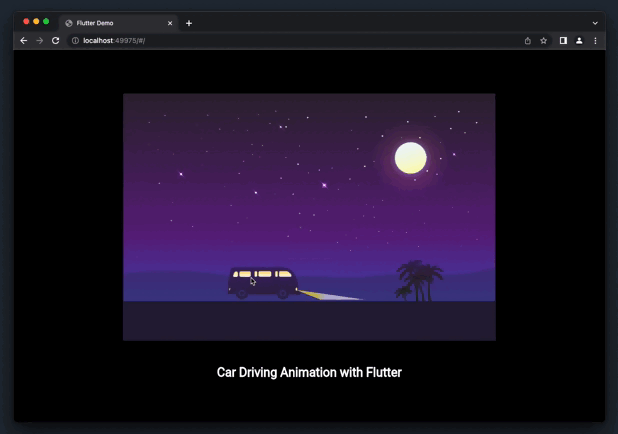
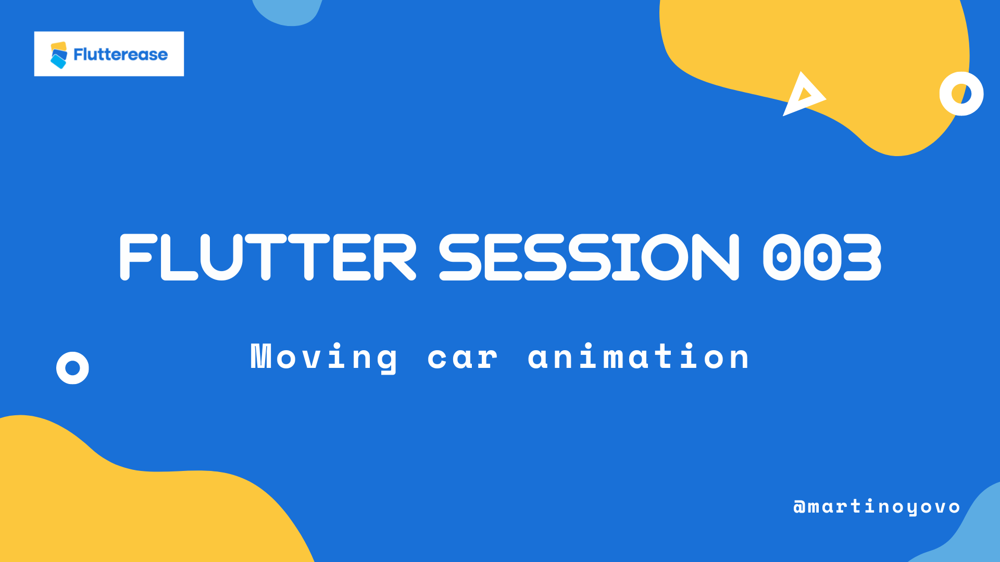

# 😍🔥 Moving car animation with Flutter 💙


About
Moving car animation using Flutter. Added also keyboard key bindings to control the move and the light of the car. Use “K” to stop the car and “L” to turn on/off the light.

Star⭐ the repo and follow me if you like what you see🤩 

## Subscribe to my [YouTube Channel](https://www.youtube.com/@flutterease001)
## [A part of my collection of Flutter Animations and UI Kits. [Show more](https://github.com/martinoyovo/flutter-design-collection)]

## Get Started
Run:
```shell
git clone https://github.com/martinoyovo/flutter-moving-car-animation.git
flutter clean
flutter packages get
flutter run
```

## Screenshots & Demo

#### Moving car animation -- [Learn how to make it](https://youtu.be/960CR8J4_tc) | [Show more](https://github.com/martinoyovo/flutter-design-collection)


---



---

A few resources to get you started if this is your first Flutter project:

- [Lab: Write your first Flutter app](https://docs.flutter.dev/get-started/codelab)
- [Cookbook: Useful Flutter samples](https://docs.flutter.dev/cookbook)

For help getting started with Flutter development, view the
[online documentation](https://docs.flutter.dev/), which offers tutorials,
samples, guidance on mobile development, and a full API reference.
